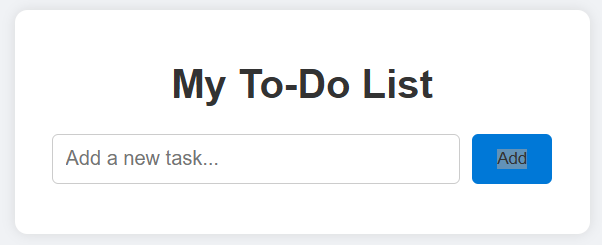

# Simple To-Do List App

A beginner-friendly web app to manage your daily tasks.  
Add, mark completed, and delete tasks with an easy-to-use interface.

## Features

- Add new tasks  
- Mark tasks as completed by clicking on them  
- Delete tasks  
- Responsive design for all devices

## How to Use

1. Open `index.html` in your web browser.  
2. Type a task in the input box and click **Add** or press Enter.  
3. Click on a task to mark it completed or uncompleted.  
4. Click the ✕ button next to a task to delete it.

## Technologies Used

- HTML  
- CSS  
- JavaScript  

## Screenshots

### Output

### To-Do List View

## Contact

Created by Dikshant Gaikwad.  
GitHub: [https://github.com/dikshantdev5](https://github.com/dikshantdev5)  
LinkedIn: [https://www.linkedin.com/in/dikshant-gaikwad-1375a130a/]

